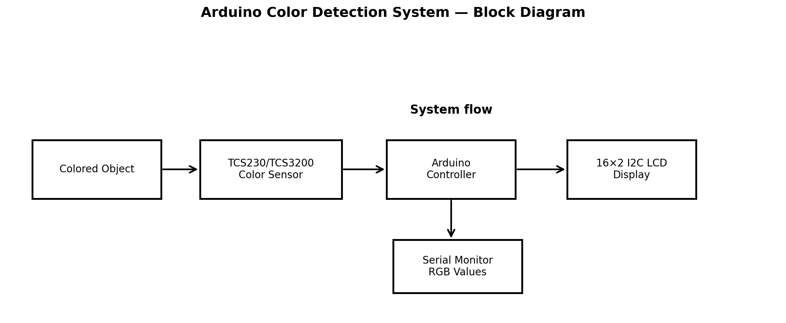
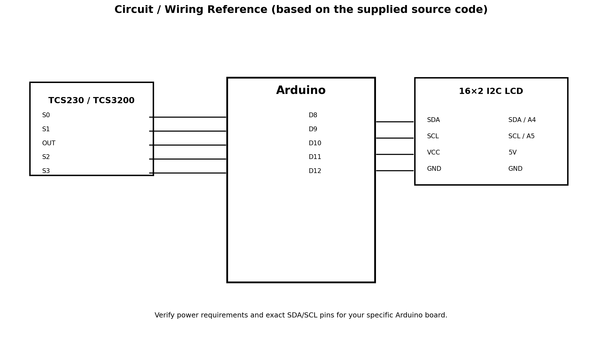
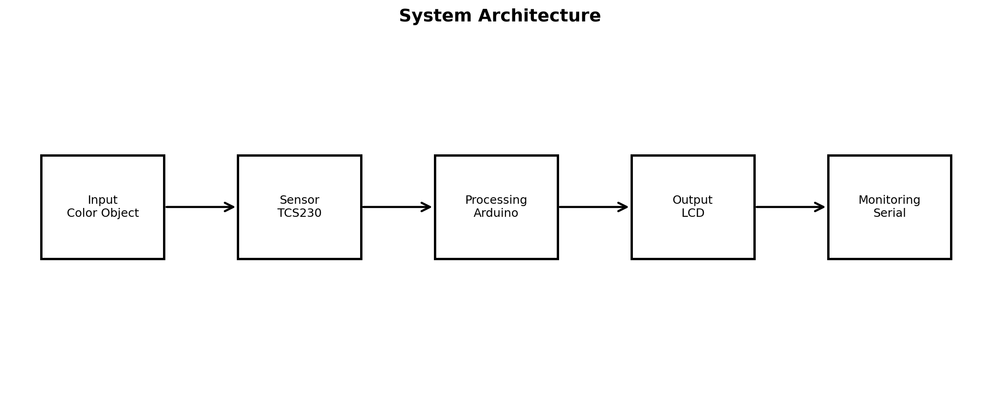
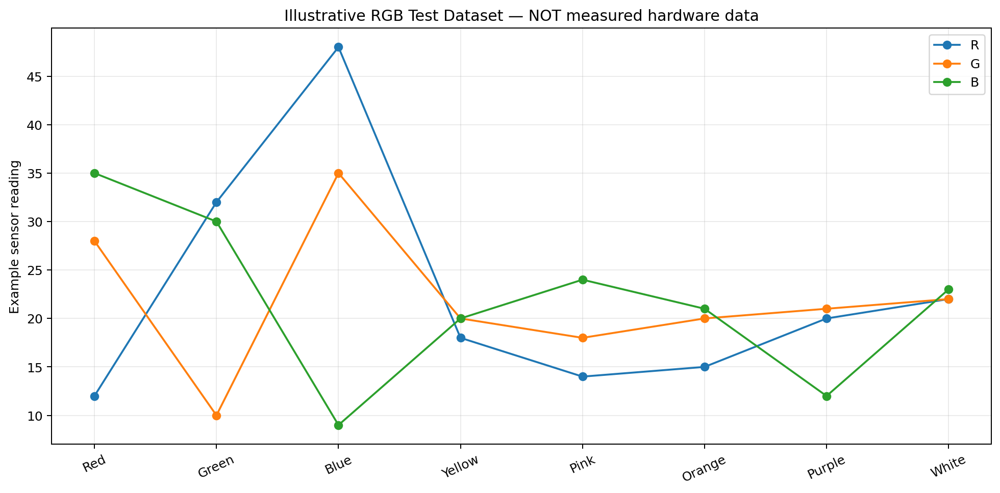

# Arduino Color Detection System

An Arduino-based real-time color detection system using a TCS230/TCS3200 color sensor and a 16×2 I2C LCD. The system measures RGB intensity through the sensor, classifies the detected color using threshold-based logic, displays the result on the LCD, and prints RGB readings to the Serial Monitor.

## Features

- Real-time RGB color sensing
- Threshold-based color classification
- 16×2 I2C LCD output
- Serial Monitor RGB readings
- Supports Red, Green, Blue, Yellow, Pink, Orange, Purple and White detection
- Simple Arduino-based implementation

## Project Overview

The TCS230/TCS3200 sensor converts the intensity of reflected red, green and blue light into a frequency signal. The Arduino measures the pulse duration from the sensor and uses the resulting RGB values in a set of classification rules.

### System Flow

```text
             ┌──────────────────────┐
             │  TCS230/TCS3200      │
             │    Color Sensor      │
             └──────────┬───────────┘
                        │ RGB frequency
                        ▼
             ┌──────────────────────┐
             │       Arduino        │
             │ Measurement + Logic  │
             └───────┬────────┬─────┘
                     │        │
              I2C    │        │ Serial
                     ▼        ▼
          ┌──────────────┐  ┌──────────────┐
          │ 16×2 I2C LCD │  │ Serial       │
          │ Detected     │  │ Monitor      │
          │ Color        │  │ RGB values   │
          └──────────────┘  └──────────────┘
```

## Hardware

| Component | Purpose |
|---|---|
| Arduino board | Main controller |
| TCS230/TCS3200 color sensor | RGB color sensing |
| 16×2 LCD with I2C module | Displays detected color |
| Breadboard | Prototyping |
| Jumper wires | Connections |
| USB cable | Programming/power |

> The exact Arduino board model should be updated in this README if it differs from the board used in the physical project.

## Pin Connections

### TCS230/TCS3200 → Arduino

| Sensor pin | Arduino pin |
|---|---:|
| S0 | D8 |
| S1 | D9 |
| OUT | D10 |
| S2 | D11 |
| S3 | D12 |

The code sets S0 and S1 HIGH, selecting the sensor's corresponding output-frequency scaling configuration.

### I2C LCD → Arduino

For a typical Arduino Uno/Nano-style I2C connection:

| LCD pin | Arduino |
|---|---|
| VCC | 5V |
| GND | GND |
| SDA | SDA |
| SCL | SCL |

The LCD address used by the program is `0x27`.

## Software Requirements

- Arduino IDE
- Arduino-compatible board
- `Wire` library
- `LiquidCrystal_I2C` library

`Wire` is normally included with the Arduino platform. If `LiquidCrystal_I2C` is not installed, install a compatible library through the Arduino IDE Library Manager.

## Installation

1. Install Arduino IDE.
2. Connect the Arduino board to the computer.
3. Open `src/color_detection.ino`.
4. Install a compatible `LiquidCrystal_I2C` library if required.
5. Select the correct board under **Tools → Board**.
6. Select the correct port under **Tools → Port**.
7. Upload the program.
8. Open **Serial Monitor** and set the baud rate to `9600`.

## Running the Project

After uploading:

1. Power the Arduino.
2. Place a colored object in front of the color sensor.
3. The sensor measures the reflected RGB components.
4. The Arduino applies the classification conditions.
5. The detected color is shown on the LCD.
6. RGB readings are printed in the Serial Monitor.

Example Serial Monitor format:

```text
R =12 G = 25 B = 30
```

The actual values depend on sensor position, illumination, object surface and calibration.

## Supported Color Classes

The current source code contains classification rules for:

- Red
- Green
- Blue
- Yellow
- Pink
- Orange
- Purple
- White

These classifications are based on threshold comparisons in the source code and may require recalibration for different lighting conditions or sensor setups.

## Project Structure

```text
Arduino-Color-Detection-System/
├── README.md
├── LICENSE
├── .gitignore
├── src/
│   └── color_detection.ino
├── docs/
│   ├── PROJECT_REPORT.md
│   ├── CIRCUIT_DIAGRAM.md
│   └── ARCHITECTURE.md
├── diagrams/
│   └── README.md
├── results/
│   ├── README.md
│   └── screenshots/
│       └── README.md
└── demo/
    └── DEMO.md
```

## Visual Documentation

### Block Diagram


### Circuit / Wiring Reference


### System Architecture


### Illustrative RGB Dataset


> The RGB chart above is an illustrative dataset for repository demonstration. Replace it with actual measurements before presenting it as experimental evidence.

## Results

The expected output is the detected color on the LCD and RGB measurement values in the Serial Monitor.

Actual project photographs, screenshots and measured test data should be added to `results/` after testing the physical prototype.

## Limitations

- Thresholds are environment-dependent.
- Ambient light can affect readings.
- Sensor distance and object orientation can affect classification.
- The current implementation uses fixed thresholds rather than an automatic calibration procedure.
- LCD address may differ on another I2C module.

## Future Improvements

- Add an automatic calibration mode.
- Average multiple sensor readings to reduce noise.
- Add more robust color-space based classification.
- Add a configurable threshold system.
- Store calibration values in EEPROM.
- Add a buzzer or LED indication.
- Add Bluetooth/Wi-Fi monitoring.
- Create a mobile/web dashboard for detected colors.

## Demo

See [`demo/DEMO.md`](demo/DEMO.md) for the demonstration procedure.

## Documentation

- [Project Report](docs/PROJECT_REPORT.md)
- [Architecture](docs/ARCHITECTURE.md)
- [Circuit Documentation](docs/CIRCUIT_DIAGRAM.md)

## License

This project is released under the MIT License. See [`LICENSE`](LICENSE).

## Author

Add your name, college, department and GitHub profile here before publishing.
